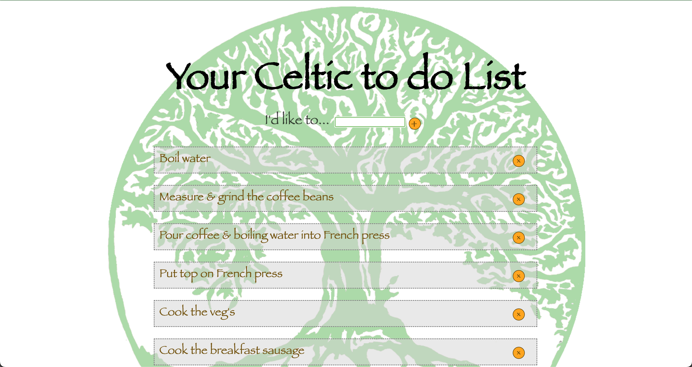
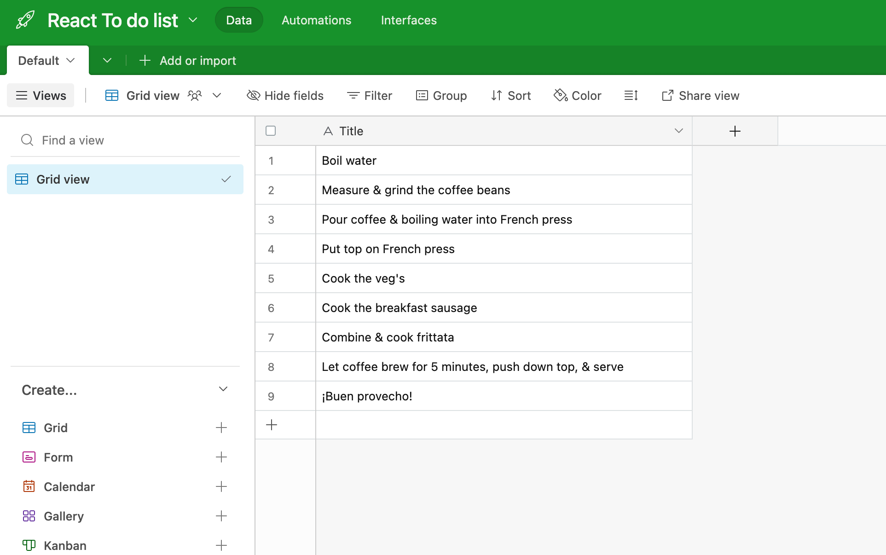

# Screenshot

See **main screen image below of website** side of To Do list sample:

See **main screen image below of Airtable** side of To Do list sample:

# Prerequisites

Install Yarn [(details here)](https://classic.yarnpkg.com/en/docs/install)

# Instructions to run

1. In terminal, run `yarn start`
2. In browser navigate to http://localhost:3000

# Background

This project was bootstrapped with **[Create React App](https://github.com/facebook/create-react-app)**.

This to-do list app was created as a part of a bootcamp with **Code the Dream School** (https://github.com/Code-the-Dream-School).
